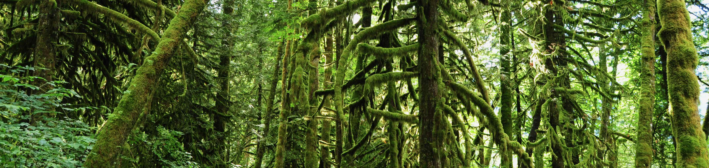
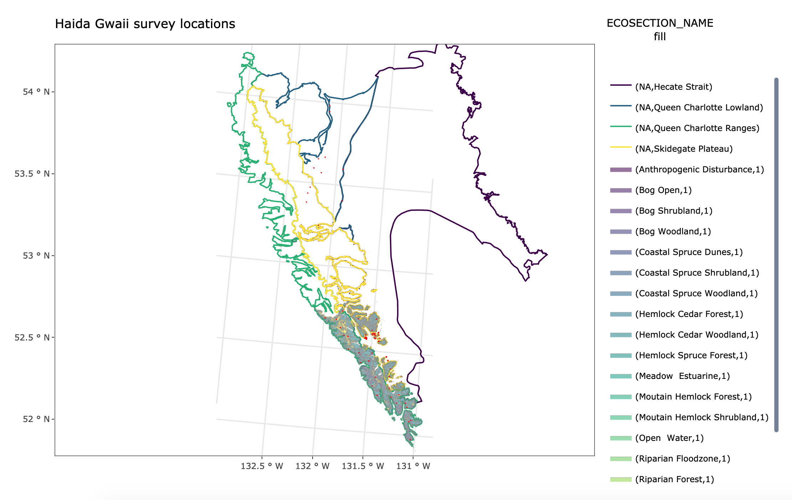

# Introduction

## Overview of study area



Haida Gwaii is an isolated island archipelago 55 - 125 km west of continental North America (53.0,-134.0) separated by the Hecate Strait. The islands support habitat ranging from lowland muskeg, to wet coastal forest to rugged upland subalpine. The climate is driven by oceanic systems from the Pacific which are lifted by insular mountain ranges along the west side of the archipelago. These low-pressure oceanic systems bring moist, mild air onto the south and central coast in the winter, offset with infrequent high-pressure systems during the summer. These climatic and topographic conditions create rainshadows and micro-climates on the leeward side of Haida Gwaii. 
Extreme wind and wave exposure occurs on the west side of the archipelago with milder, more protected areas along the Hecate Strait and inshore areas. Sandy intertidal areas from freshwater fjords and river discharge provides spawning habitat for Pacific salmon and Pacific herring, an important food source for waterbirds. Sheltered inlets, inter-island channels and sounds also provide habitat for birds.
      
### Ecoregions
    
Two **ecoregions**, an area with major physiographic and minor macroclimatic or oceanographic variation defined at the regional level, represent the study area: the *Gwaii Haanas Ecoregion (GWH)* and the *Hecate Strait Marine Ecoregion*. The Hecate is a shallow strait dominated by coarse bottom sediments and surrounding coastal lowlands. The semi-protected and strong tidal currents promote mixing thereby fostering a neritic plankton community, nurseries for salmon and herring and abundant benthic invertebrate stocks. These create prime feeding grounds for marine mammals and birds. The Gwaii Haanas Ecoregion consists of two larger islands (Graham - *Kiis Gwaay* and Moresby - *Gwaii Haanas*) and over 150 smaller islands, islets and reefs. 

- **Ecoprovince**
  - Coast and Mountains Ecoprovince
    - **Ecoregions**
      - Gwaii Haanas Ecoregion (GWH)
        - **Ecosections**
          - Queen Charlotte Lowland (QCL)
          - Queen Charlotte Ranges (QCR)
          - Skidegate Plateau (SKP)
      - Hecate Strait Marine Ecoregion

The *Queen Charlotte Lowland* is an area of low relief, poorly drained, extensive muskegs and wetlands in the northeastern part of Haida Gwaii. The area lies in a slight rainshadow of the Queen Charlotte Ranges to the west however Pacific air can easily flow bringing intense rainfall and cloud cover. Wet coastal Western Hemlock forests are abundant with much of the upland being muskeg or wetlands. This area has been the most impacted by recent anthropogenic activities as well such as forest harvesting and livestock grazing on a very small scale. Lowland habitats in rocky islets, shoreline cliffs, usually with herbaceous or shrubby vegetative cover, provides important bird nesting and roosting habitat. The *Queen Charlotte Ranges* are a very wet, rugged region with steep, forested slopes, dissected by deep sounds, channels and fjords. The area was once actively logged but has now been replaced with conservancies and Gwaii Haanas National Park Reserve. The *Skidegate Plateau* is a dissected plateau between the QCR to the west and the lower lying areas of Haida Gwaii to the east. Both the QCR and SKP are dominated by wet coastal hemlock and mountain hemlock biogeoclimatic zones at higher elevations.

```{r, Mapping, echo = T, eval = TRUE, message = F, error = F, warning= F}

#All locations were located on the Haida Gwaii archipelago. This is located within the Coast and Mountain Ecoprovince (COM), and the Gwaii Haanas (GWH) and Hecate Strait Marine Ecoregions. 

# Areas are further subdivided into ecosections and plant communities as defined by Golumbia 2001. 

library(sf)
library(bcmaps)
library(bcmapsdata)
library(vegan)
library(plotly)
library(tidyverse)

ghnp <- read_csv("/users/alexandremacphail/gwaii-haanas/allghnp.csv")

ghnp_l <- ghnp %>%
  dplyr::select(location_name, location_latitude, location_longitude) %>%
  distinct() %>%
  filter(!is.na(location_latitude))

ecoreg <- ecoregions()
ecoprov <- ecoprovinces()
ecosec <- ecosections()

h0 <- transform_bc_albers(st_as_sf(ghnp_l, coords=c("location_longitude","location_latitude"), crs=4326))
h0 <- h0 %>%
  mutate(lead = geometry[row_number() + 1],
         dist = st_distance(geometry, lead, by_element = T),) %>%
  dplyr::select(-lead)
h <- st_buffer(h0,150)

ghpc <- transform_bc_albers(st_read("/users/alexandremacphail/gwaii-haanas/gis/GHPlantCommunities_Golumbia01.shp", quiet = TRUE) %>% st_transform(crs=4326) %>% st_make_valid()) %>% na.omit()

# ocean <- st_combine(st_crop(transform_bc_albers(st_read("/users/alexandremacphail/GH/GH/gis/lhy_000h16a_e.shp", quiet=TRUE) %>% st_transform(crs=4326) %>% st_make_valid()), xmin = 529366.8, ymin = 781438.2, xmax = 748180.7, ymax = 1059955))

# map <- ggplotly(ggplot() +
#   geom_sf(data = subset(ecosec, ECOSECTION_NAME %in% c("Skidegate Plateau","Hecate Strait","Queen Charlotte Lowland","Queen Charlotte Ranges")), aes(colour = ECOSECTION_NAME, fill=NA)) +
#   geom_sf(data = ghpc, colour = "#A19E99", size = 0.2, aes(fill = HABITAT), alpha = 0.5) +
#   geom_sf(data = h, colour = "red", fill=NA) +
#   coord_sf(crs = 3005, xlim= c(522000,670000), ylim = c(775000,1057000), expand = F) +
#   scale_fill_viridis_d(guide = guide_legend()) +
#   scale_colour_viridis_d(guide = guide_legend()) + 
#   ggtitle("Haida Gwaii survey locations") +
#   theme_bw())
# 
# htmlwidgets::saveWidget(map, file = "/users/alexandremacphail/gwaii-haanas/map.html")
# webshot::webshot(url = "/users/alexandremacphail/gwaii-haanas/map.html", file = "/users/alexandremacphail/gwaii-haanas/map.png", delay = 1, zoom = 4)

```





### Forest and plant communities

The vegetation and forest type is dominated by Coastal Western Hemlock, Mountain Hemlock and Alpine Tundra Biogeoclimatic zones with increasing elevation and with decreasing representation on the landscape. 

### Avifauna on Haida Gwaii

287 species are known to be found on Haida Gwaii. 252 of these species are known breeders. Of the diverse community of species encountered on Haida Gwaii, 93 songbirds are known to be residents, migrants and breeders on the islands. Certain species such as <span class="species">Townsend's Warbler"</span> and <span class="species">Pacific-slope Flycatcher"</span> are known to be high-density residents on the archipelago. Many unique subspecies of resident non-passerines, especially raptors are noted (NSWO, NOGO, WESO). 4 introduced species (House Sparrow, European Starling, Rock Pigeon, Eurasian Collared-Dove).

```{r, haida-gwaii-species, echo = T, eval = TRUE, message = F, error = F, warning= F}

#List of species on Haida Gwaii 
hgspp <- read_csv("/users/alexandremacphail/gwaii-haanas/hgspp/avibasehg2.csv") %>% as_tibble()
# Yes means confirmed breeder, migrant or resident
# Rare / Accidental
# Yes_d was changed from Rare / Accdidental -> Yes for TOWA, CHSP, WETA
# Rare / Accidental_m is for NOFU
# COSEWIC and BC Provincial statuses are included


# Count of residents, migrants and breeders - 252 in total
hgspp %>%
  group_by(on_haida_gwaii) %>%
  summarise(n = n()) %>%
  mutate(freq = n / sum(n()))

# Count of passerine (songbird) species - 93 in total
hgspp %>%
  filter(species_order == "Passeriformes") %>%
  group_by(on_haida_gwaii) %>%
  tally() %>%
  ungroup()

knitr::kable(
  head(hgspp, booktabs = TRUE,
  caption = 'List of avifauna on Haida Gwaii. COSEWIC and British Columbia Provincial Statuses are also included.'
))

```

## Data management and processing

Data required some standardization prior to proceeding with transcription and analysis. [WildTrax](https://www.wildtrax.ca) was used to manage, store, process, centralize and subsequently share data with other users and collaborators. WildTrax requires certain metadata standards which can be summarized in the 1st edition of [WildTrax: The Definitive Guide](https://www.wildtrax.ca/home/resources/wildtrax-guide.html). 

### Location standardization

Each <span class="jargon">location</span>, a geographic and physical place on the landscape, was given a unique name. All raw acoustic recordings collected at each of these locations was then attributed these names. This created a unique spatial and temporal key to all of the acoustic data in the format of (**LOCATION_YYYYMMDD_HHMMSS**). The prefix **GHNPR** to denote points within the bounds of Gwaii Haanas National Park Reserve and **HGBC** to denote points outside the park, principally those associated with the Northern Saw-whet Owl project on Graham Island.

### Acoustic transcription

Community data were managed, stored, processed and quality controlled using [WildTrax](https://www.wildtrax.ca). 

Data were associated to each of 10 projects as follows:

- Night Birds Returning (2010)
- Night Birds Returning (2011)
- Night Birds Returning (2012)
- Night Birds Returning (2013)
- Night Birds Returning (2014)
- Night Birds Returning and Restoring Balance (2015)
- Graham Island Northern Saw-whet Owl Territory Pilot Study (2012 - 2013)
- Marbled Murrelet Pilot Study (2016)
- EI Grid Pilot Study (2016)
- EI Grid Alpine Pilot (2017)


