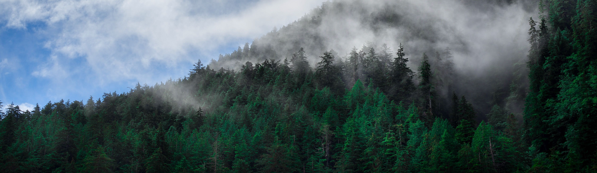

# Preface {-}

The purpose of this report is to satisfy the Scope of Work for a Contract with Gwaii Haanas National Park Reserve.



The [The Bioacoustic Unit (BU)](http://bioacoustic.abmi.ca) is a collaboration between the [Bayne Lab](https://apps.ualberta.ca/directory/person/bayne) at the [University of Alberta](https://www.ualberta.ca) and the [Alberta Biodiversity Monitoring Institute (ABMI)](https://abmi.ca) and focuses its research goals on the development and utilization of environmental sensor technology, as well as techniques and best practices for monitoring biodiversity in Canada. The BU has been mandated by this Contract to investigate ARU sampling efforts from 2010 to 2017 in Gwaii Haanas National Park Reserve by reporting on the summarized analysis and results, and to provide recommendations for improving the study design of the Gwaii Haanas’s Ecological Integrity Breeding Bird Monitoring Program. The report aims to satisfy the following tasks as outlined in the Statement of Work:

**Objectives**

* Describe the songbird community in the Juan Perez area of Haida Gwaii, determine its
community stability over the 7-year sampling period and make recommendations on how to
develop and employ a robust songbird monitoring program for Gwaii Haanas. Including methods
for targeted searches for any songbirds listed as a conservation priority.
* Provide a report on the most appropriate methodology and tools needed to assess habitat use and population status for <span class="species">Northern Saw-whet Owl (NSWO)</span> and <span class="species">Northern Goshawk (NOGO)</span> in Gwaii Haanas.

**Scope of Work**

* Identify songbirds and analyze and inventory all bird species, reporting on biodiversity and community structure over the sampling time.
* Make recommendations on a long-term monitoring design for assessing forest health with songbird data on Haida Gwaii including sample size, sampling frame, sampling frequency and report metric using ARUs. Include the results of the power analysis. 
* Make recommendations for employing targeted assessments of songbird communities for species at risk surveys and restoration efforts.
* Report on any species at risk found in the recordings, including locations and recommendations for further research and monitoring
* Using <span class="jargon">automated recognition</span> identify all NSWO on Graham Island (2012 - 2013) and Gwaii Haanas (2016 - 2017)
* Test human classification data from results in WildTrax against automated detection results; determine the strengths and weaknesses of both methods
* Provide advice on using ARUs to locate nests, assess habitat use and preference (including a power analysis where appropriate) for <span class="species">Northern Saw-whet Owl (NSWO)</span> and <span class="species">Northern Goshawk (NOGO)</span> in Gwaii Haanas

## Open data

> Open data is data that can be accessed, re-used or redistributed by anyone and is freely available in a usable and convenient format. Openly shared data benefits the scientific community and society as a whole. Maximal data accessibility allows users (e.g., researchers, conservation practitioners and the public) to find, manipulate and analyze data, as well as link avian data to other types of information. Open data can lead directly to conservation knowledge and action. This requires data to be usable, inter-operable and reliable.
>

The Bioacoustic Unit and WildTrax are proponents in making data as open and accessible as possible and many organizations in are shifting towards a more open, collaborative, co-produced framework in order to answers ecological questions. 

## Objectives of WildTrax

- To ***manage*** all components of environmental sensor and biological data from field metadata to media to species observations
- To ***store*** data safely and securely while still making it accessible to users
- To ***process*** environmental sensor data to a high degree of data quality and integrity
- To ***share*** environmental sensor and biological data with other WildTrax users, collaborators and the public

## Using this book

The goal of this book is to provide a comprehensive, accessible, engaging and referenceable set of documentation in order to satisfy the scope of this report. 

You can jump to different sections of the book using the [links](#using-this-book). 

WildTrax specific tools, functions or just general jargon is stylized like <span class="jargon">tasks</span> or <span class="jargon">two-stage subsampling</span>.

Species are stylized like <span class="species">Ovenbird (OVEN)</span>, <span class="species">Wolverine</span> or <span class="species">Tennessee Warbler (TEWA)</span>. The four-letter codes follow the most recent taxonomic workbench in WildTrax.

Things specific to Gwaii Haanas are in <span class="gh">purple</span>.

```{r include=FALSE}
# automatically create a bib database for R packages
knitr::write_bib(c(
  .packages(), 'bookdown', 'knitr', 'rmarkdown'
), 'packages.bib')
```
